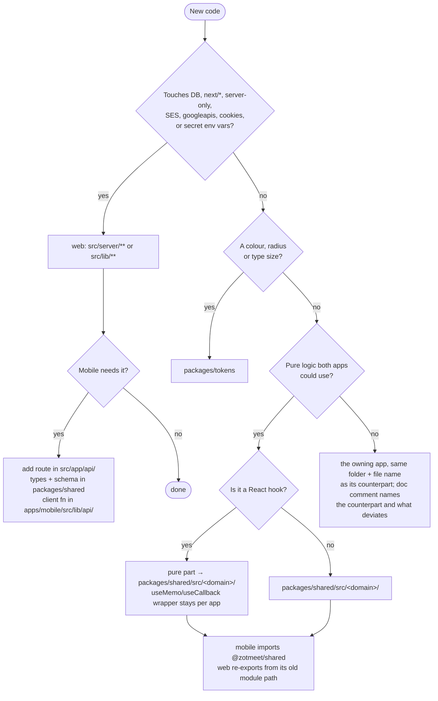

# CLAUDE.md — ZotMeet

Rules for working in this repo. Read once; follow every session. Longer rationale lives in
`apps/mobile/README.md` (mobile conventions, the web↔mobile file mapping, and the native
sign-in flow). Do not duplicate that doc here; update it when a rule below changes.

## 1. Repo shape

pnpm workspace (`pnpm-workspace.yaml`: `apps/*`, `packages/*`). Three code owners of logic:

| Package | Path | What lives here | Runtime |
|---|---|---|---|
| web (root) | `src/` | Next.js 16 app (App Router, RSC, server actions), Drizzle, the `/api/*` routes mobile calls, PWA | Node + browser |
| `@zotmeet/mobile` | `apps/mobile/` | Expo SDK 57 / RN 0.86 app, Expo Router, NativeWind | Hermes (iOS/Android/web preview) |
| `@zotmeet/shared` | `packages/shared/` | **Pure** TS: time maths, `ZotDate`, grid/paint/fill logic, meetings helpers, zod schemas, API wire types, OAuth contract | Any |
| `@zotmeet/tokens` | `packages/tokens/` | Colour tokens + brand hex (`index.js`), Tailwind colour/radius wiring (`tailwind.js`), type ramp (`typography.js`) — plain CommonJS | Any |

- Mobile **never** imports from `/src`. Web **never** imports from `apps/mobile`.
- Mobile has **no backend**. It calls `src/app/api/**/route.ts`, which wrap existing `@actions/*` / `@data/*` functions.
- The web app is being phased out in favour of Expo, but the Next.js **server** (API routes, auth callbacks, invite/SEO pages) stays. Do not delete server code because "mobile doesn't use it".

## 2. Where does new code go? (decision rules)



Apply in order; stop at the first match.

1. **Touches the DB, `next/*`, `server-only`, SES, `googleapis`, cookies, or `process.env` secrets** → `src/server/**` or `src/lib/**` (web). Expose to mobile via a route in `src/app/api/` (see §4).
2. **Pure logic both apps could need** (date/time, grid maths, sorting/filtering, formatting, validation, wire types, constants/enums) → `packages/shared/src/<domain>/`. Then:
   - mobile imports `@zotmeet/shared` directly;
   - web keeps its existing import path by **re-exporting** from the old module (`src/lib/types/chrono.ts`, `src/lib/availability/utils.ts`, etc.). Do not rewrite web imports just to point at the package.
3. **A colour, radius or type size** → `packages/tokens`. Never a hex/HSL/px literal in a component, theme or Tailwind config.
4. **Platform-specific rendering, gestures, navigation, storage, crypto** → the app that owns it, under the **same folder and file name** as its counterpart (`components/availability/table/availability-block.tsx` exists in both). Put a doc comment at the top naming the counterpart and what deviates.
5. **A React hook** → stays in the app. `@zotmeet/shared` has no React dependency; extract the pure function into shared and wrap it in `useMemo`/`useCallback` per app.

Same-named files that are **intentionally separate** — do not merge them: `lib/utils.ts` (`cn`; mobile's extends tailwind-merge), `lib/auth/*` (server half vs device half of one protocol), `lib/meetings/delete-leave-action.ts` (icon component vs icon name), `nativeRedirectUriOptions` (reads `process.env` vs `expo-constants`), and every `components/**` pair. The two audit items left unconsolidated because they are *not equivalent* — the personal-edit lifecycle (web `hooks/use-edit-state.ts` + `use-availability-action-handlers.ts` vs mobile's inline snapshot) and the month-grid maths (`ZotDate.generateZotDates` vs mobile `lib/date.ts#getMonthGrid`) — need a design call before either is shared.

What `@zotmeet/tokens` owns (both apps read it; change it there or nowhere): colour tokens (`index.js`), the Tailwind colour/radius wiring (`tailwind.js`), the type ramp (`typography.js` → `muiTypography()` for `src/theme.ts`, `tailwindFontSize()` for the Expo config), and the brand hex used by the manifest, icon script and `app.config.ts` (`brand`).

Constraints on `@zotmeet/shared`:

- No `react`, `zustand`, DOM, `next/*`, `@/db`, `expo-*`, `react-native`. Dependencies are `date-fns`, `date-fns-tz`, `zod` only. Adding another is a team decision, not a PR side effect.
- Types are **structural** (`Pick<...>` of the fields read), never Drizzle row types. Where the web has a Drizzle-derived twin, pin them together with a typecheck assertion (pattern: `src/lib/types/availability.ts:26-31`).
- Every export must work identically on Node, browser and Hermes (no `Intl` features Hermes lacks, no `AbortSignal.any`, no `crypto.subtle`).

## 3. Stack standards

### Both apps
- React 19.2.3, zod 3, zustand 5, Tailwind 3.4 syntax, `clsx` + `tailwind-merge` via `cn()`, Biome for lint/format (`pnpm check`). Conventional commits with devmoji (`feat: ✨ …`, `fix: 🐛 …`).
- Filenames kebab-case; components `PascalCase` exports; stores `useXStore.ts`; hooks `use-x.ts`.
- No test runner exists yet. If you add tests, start in `packages/shared` (pure, no DOM) and propose the runner in the PR — don't add a second runner later.

### Web (`src/`)
- UI: **MUI 7** is the component library (`@mui/material`, `@mui/icons-material`). Style with `sx` for MUI components and Tailwind `className` for layout; both are acceptable, don't convert one to the other in passing. `src/components/ui/` holds shadcn/Radix leftovers — don't add new shadcn components.
- Theme: `src/theme.ts` `getTheme(mode)`; colours via `hsl()` from tokens. Dark mode is the `.dark` class.
- Fonts: `src/fonts.ts` (`next/font/google` Figtree). Icons: `@mui/icons-material` named imports.
- Routing: App Router, `next/navigation`, `next/link`. URL-persisted form state: `nuqs`.
- Data: server components + server actions (`@actions/<entity>/<verb>/action.ts`, `@data/<entity>/queries.ts`). No client-side fetch layer; don't add React Query/SWR to the web without a team decision.
- Forms: plain `useState`. `react-hook-form` is installed but unused — don't start using it.
- Auth: `getCurrentSession()` from `@/lib/auth` in RSC/actions/routes; bearer via `getMemberIdFromBearer` in API routes only.

### Mobile (`apps/mobile/`)
- UI: **no MUI**. Use `src/components/ui/*` primitives, which copy MUI's prop vocabulary (`Button variant="contained"`, `Typography variant="h6" color="textSecondary"`, `IconButton size="small"`). Check that folder and the web's `components/ui` before building a primitive; keep MUI prop names so Figma specs and web snippets port 1:1.
- Styling: NativeWind `className` only. `StyleSheet`/inline `style` only for values classes can't express (measured layout, animated values).
- Tokens: `bg-primary`, `text-muted-foreground`, etc. Raw colour props (`placeholderTextColor`, navigator tints) → `colorsFor(colorScheme)` from `lib/theme.ts`.
- Type ramp: `text-h6`, `text-body2`, `text-caption`, `text-button-md`. Weights are families: `font-figtree-medium/semibold/bold`; `font-bold` does nothing. Adding a `fontSize` or `borderRadius` key to `tailwind.config.js` **requires** adding it to the `extendTailwindMerge` list in `src/lib/utils.ts`.
- Icons: `<Icon name="more-vert" />` from `lib/icons.tsx` (Material Icons; MUI name kebab-cased). No SVG exports.
- Navigation: Expo Router, typed routes. Mirror web paths (`/availability/[slug]`, `/groups/[id]`).
- Data: `lib/api/client.ts` `apiFetch` → `lib/api/<domain>.ts` functions → hooks in `hooks/`. Validate request bodies with the shared zod schema before sending.
- Animation/gesture: `react-native-reanimated`, `react-native-gesture-handler`, `expo-haptics`. No `Animated` from `react-native` — reanimated is the one animation library.
- Auth: `useAuthStore` is the only reader of session state. Token lives in `expo-secure-store`; never in AsyncStorage, never logged.
- Dev token (`EXPO_PUBLIC_API_TOKEN`) is read only under `__DEV__`; never put it in `eas.json`/`app.config.ts`.

## 4. Exposing something to mobile

1. Find the existing `@actions`/`@data` function. If the action is cookie-coupled, split it into `xForMember(data, memberId)` + the thin action (pattern: `createMeetingFromData`, `archiveMeetingForMember`).
2. Add `src/app/api/<path>/route.ts`: `getMemberIdFromBearer` → parse body with the shared zod schema → call the function → JSON. Build the response with `satisfies <ResponseType>`.
3. Put request/response types (and schema) in `packages/shared/src/<domain>/schema.ts`.
4. Add the client function in `apps/mobile/src/lib/api/<domain>.ts`.
5. Never reimplement server logic in the route or on the device.

## 5. Commands

```bash
pnpm dev                                   # web + /api on :3000 (Postgres on :5434 via docker)
pnpm mobile                                # Expo dev server (needs pnpm dev running)
pnpm check                                 # Biome lint+format, whole repo
pnpm --filter @zotmeet/shared typecheck
pnpm --filter @zotmeet/mobile typecheck    # TS 6.0
npx tsc --noEmit                           # web, TS 5.9 (root tsconfig excludes apps/)
pnpm db:setup | db:migrate | db:generate | db:seed
```

Before finishing any change that touches `packages/**`: run all three typechecks. Before touching `apps/mobile/**`: also `pnpm check`. CI does not run typechecks — you are the gate.

## 6. Gotchas

- TypeScript is 5.9 on web/shared and 6.0 on mobile. Shared code must satisfy both.
- `pnpm-workspace.yaml` sets `minimumReleaseAge: 1440` — a package version released today will fail to install; pin one patch back.
- `next.config.mjs` `transpilePackages: ["@zotmeet/shared"]` — a new workspace package consumed by web must be added there.
- `EXPO_PUBLIC_*` vars are inlined at bundle time; restart Expo after changing them.
- Storage: `fromTime`/`toTime` are UTC `"HH:MM:SS"`; `dates` are ISO local-midnight instants; "days of week" meetings store `ANCHOR_DATES`. Use `convertTimeToUTC` / `convertTimeFromUTC` / `localMidnightFromIsoDate` from shared — never `new Date(iso)` for a day column.
- Biome ignores `src/components/ui/**` and `tailwind.config.ts` but **not** their mobile equivalents.
- `ios/` is the PWABuilder Swift wrapper, not Expo. `apps/mobile/app.config.ts` reuses its bundle id `com.zotmeet` — resolve before any EAS store build.

## 7. Things not to do without asking

- Add a dependency to `@zotmeet/shared`, or React/zustand anywhere in `packages/`.
- Add a data-fetching library, form library, or second component library to either app.
- Move code between web and mobile, or "clean up" the same-named pairs §2 lists as intentionally separate.
- Change colour values in `packages/tokens` (they are the Figma source of truth) or the MUI palette in `src/theme.ts`.
- Delete web features mobile lacks (groups, notifications, study rooms, Google Calendar import, Apple sign-in, guest availability).
- Commit or push.
