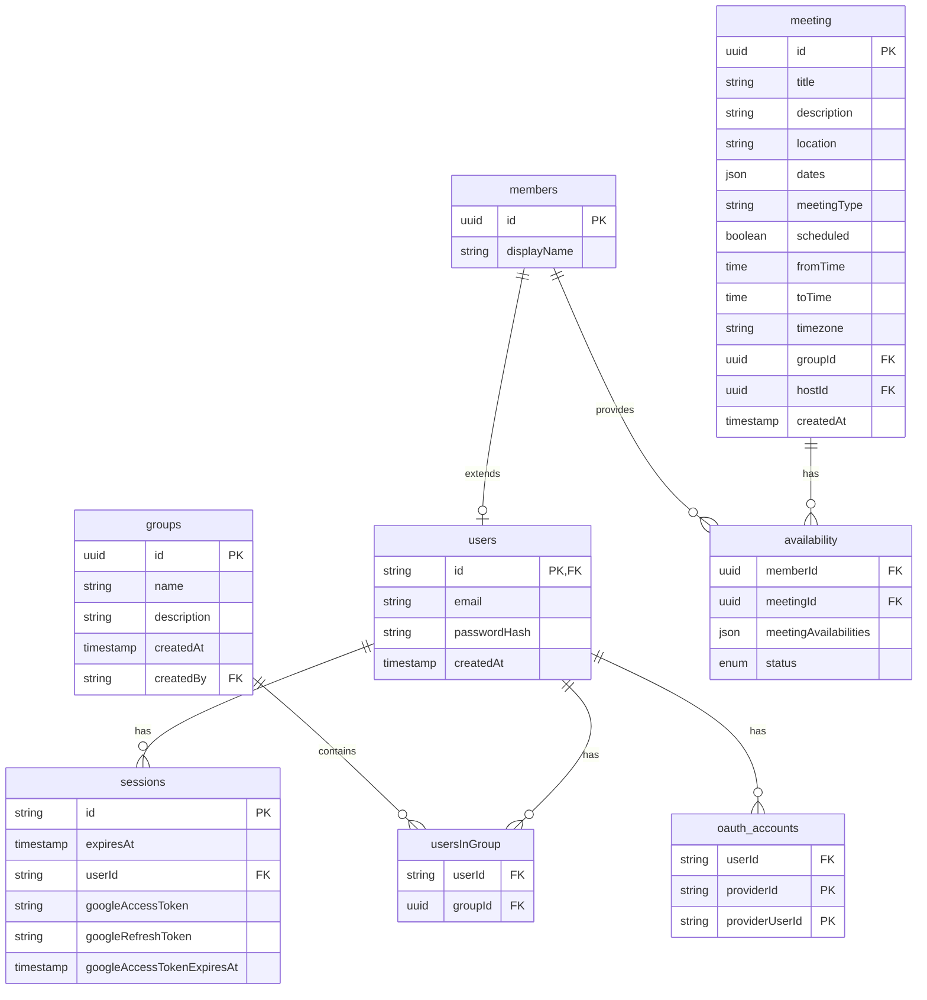

# About

Simple, clean, and efficient meeting scheduling app.

## Tech Stack

- [SST](https://sst.dev)
- [Drizzle](https://orm.drizzle.team/)
- [Lucia](https://lucia-auth.com)
- [Next](https://nextjs.org/)

# Contributing

## Project Structure

```md
├── README.md
├── drizzle.config.ts
├── next.config.mjs
├── node_modules
├── package.json
├── src
│   ├── app
│   │   └── [ all front-end routes ]
│   ├── components
│   │   └── [ front-end components ]
│   ├── db
│   │   ├── index.ts
│   │   ├── migrations
│   │   └── schema.ts
│   ├── lib
│   └── server
│       ├── actions ( mutate or insert data )
│       │       └── [ entity ]
│       │           └── [ verb ]
│       │               └── action.ts
│       └── data ( query data )
│           └── [ entity ]
│               └── queries.ts
└── tsconfig.json
```

## Local Development

### Prerequisites

- [Git](https://git-scm.com/downloads)
- [Node.js](https://nodejs.org/en/)
- [pnpm](https://pnpm.io)
  - Just run `npm i -g pnpm` to install.
- [Docker Desktop](https://www.docker.com/products/docker-desktop/) 

### Local Setup

1. Clone this repository locally
2. Navigate to the root directory and install the dependencies.
   1. `cd ZotMeet`
   2. `pnpm install`
3. Copy the example environment file:
   ```bash
   cp .env.example .env
   ```
4. Make sure Docker Desktop is running, then set up the database:
   ```bash
   pnpm db:setup
   ```
5. Start the development server
   1. `pnpm dev` (run `pnpm dev --host` if you want to access the server from other devices on your network)
6. The app should be viewable at `localhost:3000` by default.

### Database Commands

| Command | Description |
|---------|-------------|
| `pnpm db:setup` | Start database and run migrations (first time setup) |
| `pnpm db:start` | Start the PostgreSQL container |
| `pnpm db:stop` | Stop the PostgreSQL container (data persists) |
| `pnpm db:reset` | Reset database - removes all data and re-runs migrations |
| `pnpm db:generate` | Generate new migrations from schema changes |
| `pnpm db:migrate` | Apply pending migrations |
| `pnpm db:studio` | Open Drizzle Studio to browse your database |

### Committing Changes

- Follow the [Conventional Commits](https://www.conventionalcommits.org/en/v1.0.0/#summary) specification when writing commit messages.
  - E.g., `git commit -m "feat: add this feature"`; `git commit -m "fix: fix this bug"`.
- Keep commits and PRs atomic.
  - A PR should be a single feature or bug fix.
  - A commit should be a single logical change.

### Environment Variables

If you need credentials for the `.env` file, contact the project lead ([Kyle](https://github.com/kylebtran/)).

After changes to the .env file, run `pnpm run check` to update SvelteKit's auto-generated environment variable types.

### Database Schema


