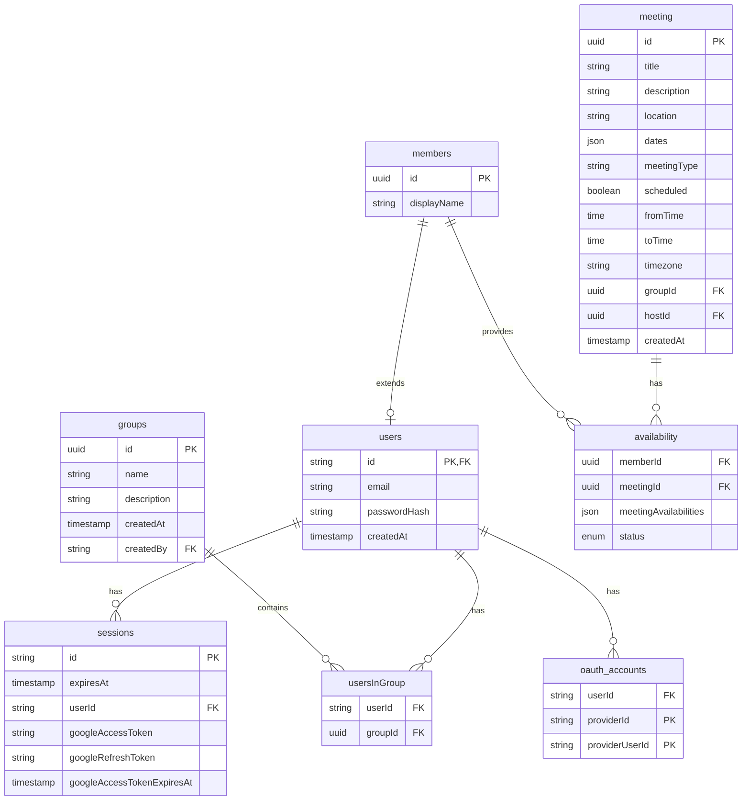

# About

Simple, clean, and efficient meeting scheduling app.

## Tech Stack

- [SST](https://sst.dev)
- [Drizzle](https://orm.drizzle.team/)
- [Lucia](https://lucia-auth.com)
- [Next](https://nextjs.org/)

# Contributing

## Project Structure

```md
├── README.md
├── drizzle.config.ts
├── next.config.mjs
├── node_modules
├── package.json
├── src
│   ├── app
│   │   └── [ all front-end routes ]
│   ├── components
│   │   └── [ front-end components ]
│   ├── db
│   │   ├── index.ts
│   │   ├── migrations
│   │   └── schema.ts
│   ├── lib
│   └── server
│       ├── actions ( mutate or insert data )
│       │       └── [ entity ]
│       │           └── [ verb ]
│       │               └── action.ts
│       └── data ( query data )
│           └── [ entity ]
│               └── queries.ts
└── tsconfig.json
```

## Local Development

### Prerequisites

- [Git](https://git-scm.com/downloads)
- [Node.js](https://nodejs.org/en/)
- [pnpm](https://pnpm.io)
  - Just run `npm i -g pnpm` to install.
- [Docker Desktop](https://www.docker.com/products/docker-desktop/) 

### Local Setup

1. Clone this repository locally
2. Navigate to the root directory and install the dependencies.
   1. `cd ZotMeet`
   2. `pnpm install`
3. Copy the example environment file:
   ```bash
   cp .env.example .env
   ```
4. Make sure Docker Desktop is running, then set up the database:
   ```bash
   pnpm db:setup
   ```
5. Start the development server
   1. `pnpm dev` (run `pnpm dev --host` if you want to access the server from other devices on your network)
6. The app should be viewable at `localhost:3000` by default.

### Database Commands

| Command | Description |
|---------|-------------|
| `pnpm db:setup` | Start database and run migrations (first time setup) |
| `pnpm db:start` | Start the PostgreSQL container |
| `pnpm db:stop` | Stop the PostgreSQL container (data persists) |
| `pnpm db:reset` | Reset database - removes all data and re-runs migrations |
| `pnpm db:generate` | Generate new migrations from schema changes |
| `pnpm db:migrate` | Apply pending migrations |
| `pnpm db:studio` | Open Drizzle Studio to browse your database |
| `pnpm db:seed` | Seed the database with a group and up to 20 random test users |

### Committing Changes

- Follow the [Conventional Commits](https://www.conventionalcommits.org/en/v1.0.0/#summary) specification when writing commit messages.
  - E.g., `git commit -m "feat: add this feature"`; `git commit -m "fix: fix this bug"`.
- Keep commits and PRs atomic.
  - A PR should be a single feature or bug fix.
  - A commit should be a single logical change.

### Environment Variables

If you need credentials for the `.env` file, contact the project lead ([Kyle](https://github.com/kylebtran/)).

After changes to the .env file, run `pnpm run check` to update SvelteKit's auto-generated environment variable types.

### Seeding the Database (for Testing)

The seed script (`src/db/seed.ts`) creates a group called **"ZotMeet Test Group"** and populates it with up to 20 randomly generated users. This is useful for testing features like availability views and group dashboards without needing real accounts.

To seed:

```bash
pnpm db:seed
```

The script can be run multiple times — each run adds up to 20 more randomly generated members to the group, so you can keep running it to grow the group as needed.

**Important:** The script cannot access your session, so it has no way of knowing your user ID. After seeding, you must manually add yourself to the group:

1. Open Drizzle Studio: `pnpm db:studio`
2. Find your id (google) in the `users` table.
3. Insert a row into `usersInGroup` with your ID and the seeded group's ID.

## Progressive Web App / iOS App Store

ZotMeet ships as an installable PWA and is packaged for the Apple App Store
through [PWA Builder](https://www.pwabuilder.com/).

### What's wired up

- **Web App Manifest** at `/manifest.webmanifest` (generated by
  `src/app/manifest.ts`) with `name`, `short_name`, `description`, `start_url`,
  `display: standalone`, `background_color`, `theme_color`, `icons` (any +
  maskable, including a 512x512), `shortcuts`, and `categories`.
- **Service worker** at `public/sw.js` (network-first navigations, cache-first
  for static assets, offline fallback at `public/offline.html`). Registered
  client-side in `src/components/pwa/service-worker-registration.tsx`.
- **Apple meta tags** (`apple-mobile-web-app-capable`,
  `apple-mobile-web-app-status-bar-style`, `apple-touch-icon`) emitted via
  `metadata.appleWebApp` and `metadata.icons` in `src/app/layout.tsx`.
- **Security headers** (`Strict-Transport-Security`, `X-Content-Type-Options`,
  `X-Frame-Options`, `Referrer-Policy`, `Permissions-Policy`) in
  `next.config.mjs`.
- **Icons** generated from `public/zotmeet-logo.svg` via
  `pnpm pwa:icons` (uses `sharp`). Output goes to `public/icons/` and
  `public/apple-touch-icon.png`.
- **`robots.txt`** and **`sitemap.xml`** at the site root.

### Configuring the production URL

PWA Builder requires the manifest's URLs to be absolute and reachable over
HTTPS. Set `NEXT_PUBLIC_APP_URL` in your deployed environment to the canonical
production URL (e.g. `https://zotmeet.com`). It is consumed by Open Graph,
robots, and sitemap metadata.

### Packaging for the iOS App Store

1. Deploy the app to its public HTTPS URL.
2. Visit [pwabuilder.com](https://www.pwabuilder.com/) and enter the URL.
3. Resolve any remaining items on the report card (screenshots, etc.).
4. Click `Package for stores` → `iOS` → `Generate Package`.
5. Take note of the `Bundle ID` and download the package.
6. Open the generated `.xcworkspace` in Xcode (≥ iOS 17 SDK), run
   `pod install` in `src/`, build, and archive for distribution following the
   [PWA Builder iOS guide](https://docs.pwabuilder.com/#/builder/app-store).

### Regenerating PWA icons

```bash
pnpm pwa:icons
```

This re-renders all icon sizes (`72`–`1024`), maskable icons (`192`, `512`),
the Apple touch icon (`180x180`), and favicons from `public/zotmeet-logo.svg`.
Commit any changes under `public/icons/` and `public/apple-touch-icon.png`.

### Database Schema


```mermaid
erDiagram
    users {
        string id PK, FK
        string email
        string passwordHash
        timestamp createdAt
    }
    groups {
        uuid id PK
        string name
        string description
        timestamp createdAt
        string createdBy FK
    }
    usersInGroup {
        string userId FK
        uuid groupId FK
    }
    members {
        uuid id PK
        string displayName
    }
    availability {
        uuid memberId FK
        uuid meetingId FK
        json meetingAvailabilities
        enum status
    }
    meeting {
        uuid id PK
        string title
        string description
        string location
        json dates
        string meetingType
        boolean scheduled
        time fromTime
        time toTime
        string timezone
        uuid groupId FK
        uuid hostId FK
        timestamp createdAt
    }
    sessions {
        string id PK
        timestamp expiresAt
        string userId FK
        string googleAccessToken
        string googleRefreshToken
        timestamp googleAccessTokenExpiresAt
    }
    oauth_accounts {
        string userId FK
        string providerId PK
        string providerUserId PK
    }

    meeting ||--o{ availability : has
    users ||--o{ usersInGroup : has
    groups ||--o{ usersInGroup : contains
    members ||--o| users : extends
    members ||--o{ availability : provides
    users ||--o{ sessions : has
    users ||--o{ oauth_accounts : has
```
